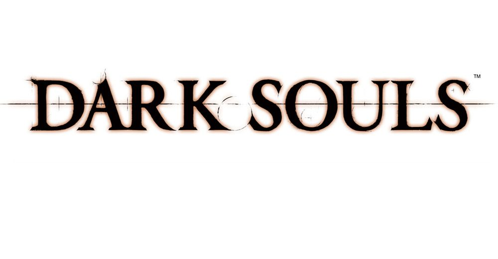

# [2024.1] Dark Souls

    
    
 Figura 1: Logo de Dark Souls.
 

## Sobre

Este repositório pertence à turma de Sistemas de Banco de Dados 1 (SBD1) do prof. Maurício Serrano, cujo propósito é desenvolver uma adaptação para MUD do jogo **Dark Souls**, como foco no projeto e implementação do banco de dados.

## Integrantes do grupo
| Nome | Matrícula |
| --- | --- |
| Daniel Nunes Duarte | 211062910 |
| Eduardo Ferreira de Aquino | 211030710 |
| Guilherme Meister Correa | 202016382 |
| Victor Augusto de Sousa Camara | 221031238 |

## Entrega 1
[Diagrama Entidade-Relacionamento](https://github.com/SBD1/2024.1-Dark-Souls/tree/main/Docs/DER)  
[Modelo Relacional](https://github.com/SBD1/2024.1-Dark-Souls/tree/main/Docs/MER)  
[Apresentação em vídeo](https://drive.google.com/drive/folders/1jsOPc5IfLc40cTsItg90vuSgNKEpWZtJ)

